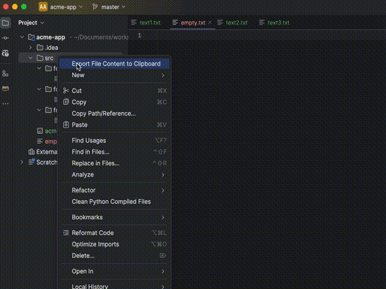

# 📋🚀 Export Source to Clipboard – IntelliJ Plugin

**Supercharge your code sharing and AI workflows directly from IntelliJ IDEA!**

The **Export Source to Clipboard** plugin transforms your coding environment into an AI-ready powerhouse by effortlessly packaging your source code and relevant file paths directly into your clipboard—ideal for instant collaboration and seamless integration with Large Language Models (LLMs).

---

### 🎯 Why Use Export Source to Clipboard?

Sharing precise code snippets along with their paths accelerates understanding and boosts productivity. This plugin ensures every snippet shared retains critical context, helping team members and AI tools quickly grasp the project structure and logic, dramatically improving LLM-driven analysis and responses. You maintain full control over tokens sent to LLMs, preventing context overflow and optimizing AI interactions.

---

### ✨ Key Features

* **🚀 AI-Ready Sharing:** Instantly prepares your code snippets with context for smarter AI analysis.
* **🤝 Seamless Collaboration:** Effortlessly share detailed, contextual code snippets with teammates or AI assistants.
* **📂 Smart Directory Processing:** Automatically compiles entire directories into a clean, shareable format while intelligently skipping binaries, ignored files (e.g., `.gitignore`), and overly large files.
* **🔢 Token Count Estimation:** Get instant feedback on estimated token usage, making it easier to stay within LLM limits.
* **🧹 Stack Trace Folding:** Easily fold long, noisy stack traces to highlight the relevant information, simplifying error investigation.
* **⚙️ Advanced Configuration:** Easily set custom limits for file count, size, ignored paths, and file types directly from IntelliJ's settings.
* **🔔 Real-time Feedback:** Receive clear, intuitive notifications on export status, processed files, and any exclusions.
* **🛠️ IntelliJ Integrated:** Seamlessly fits into your existing IntelliJ workflow using familiar interfaces and interactions.

---

### 🧑‍💻 How to Get Started

**1. Install the Plugin**

* Navigate to: `Settings/Preferences` ➜ `Plugins` ➜ `Marketplace`
* Search for "Export Source to Clipboard" and click install.

**2. (Optional) Customize Your Settings**

* Head over to: `Settings/Preferences` ➜ `Tools` ➜ `Export Source to Clipboard` and adjust to your workflow:

  * Set file size and file count limits.
  * Toggle file path prefixes.
  * Manage file extensions and ignored patterns.

**3. Export Your Source**

* Right-click a file or directory in your Project View.
* Choose "Export Source to Clipboard" and your snippet is ready!

**4. Paste and Go!**

* Simply paste your clipboard content into any AI tool, chat, or collaboration environment.

---

### 🚧 What's New?

#### Version 1.7 – Enhanced Stack Traces & Gitignore Magic ✨

* **📜 Gitignore Mastery:** Significantly upgraded gitignore parsing with hierarchical rule handling, caching optimizations, and precise pattern matching.
* **📌 Stack Trace Folding:** Introduced intelligent stack trace folding, making error logs cleaner by collapsing external frames and highlighting your project's code.
* **🚀 Accuracy Boosts:** Optimized token counting for GPT-4 accuracy, significantly enhancing export speed and responsiveness.

#### Version 1.6 – Powerful New Improvements

* **📜 Gitignore Integration:** Automatically respects your `.gitignore` settings, providing clean and relevant exports.
* **🧮 Token Count Insights:** Know exactly how much code you're exporting, helping you avoid LLM context overflow.
* **🎚️ Enhanced Settings Interface:** Now easier than ever to customize export limits and exclusions, with intuitive validation and user-friendly feedback.

---

### 🤝 Contribute

Your insights and contributions help make this tool better! Fork, modify, and submit pull requests—we’re excited to see your ideas.

---

### 📜 License

Distributed under the MIT License. See the [LICENSE](LICENSE) file for full details.

Clipboard icon by [janjf93](https://pixabay.com/vectors/flat-design-symbol-icon-www-2126883/) (Pixabay License).

---

Made with ❤️ by [Antonio Agudo](https://www.antonioagudo.com)
